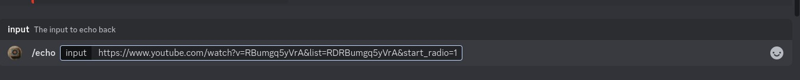
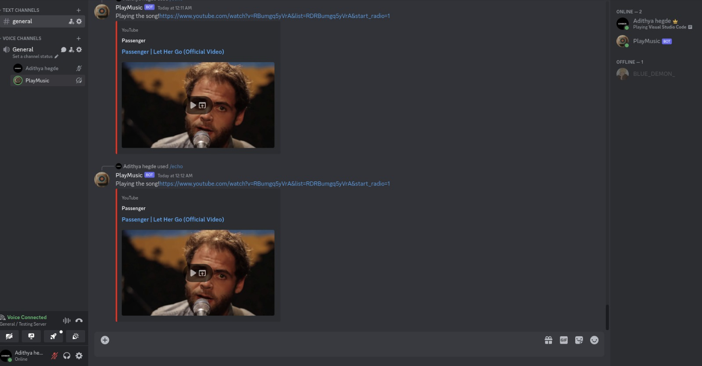

# Discord Music Bot 🎵

This repository contains the code for a Discord music bot that allows users to play songs from YouTube in voice channels.


## Table of Contents

- [Features](#features)
- [Requirements](#requirements)
- [Installation](#installation)
- [Future Works](#FutureWorks)
- [Usage](#usage)
- [Contributing](#contributing)
- [License](#license)

## Features <a name="features"></a>

- Play songs from YouTube URLs
- Join and leave voice channels
- Control playback (pause, resume, stop)

## Requirements <a name="requirements"></a>

- Node.js and npm (or yarn)
- A Discord bot token

## Installation <a name="installation"></a>

1. Clone this repository.
2. Install the required dependencies:

   ```bash
   npm install
   ```

### Note: Ensure you have npm or yarn installed on your system before running this command.

Usage <a name="usage"></a>
Run the bot using:

```Bash
node PlayMusic.cjs
```

Use code with caution.
Invite the bot to your Discord server.

Join a voice channel.

Use the !play <url> command to play a song from YouTube.

Example:

```
!play https://www.youtube.com/watch?v=dQw4w9WgXcQ
```

# Working

### Inputs

   
  
### Result
   

# Future Works <a name="FutureWorks"></a>

- [x] Play Songs Based on user input
- [ ] Play Songs according to user's Mood
- [ ] Deploy using Walfiy
- [ ] Functionality for Queue of Songs,Skip,Pause

# Contributing <a name="contributing"></a>

Feel free to fork this repository and contribute your improvements!

# License <a name="license"></a>

This project is licensed under the MIT License. See the LICENSE file for details.
